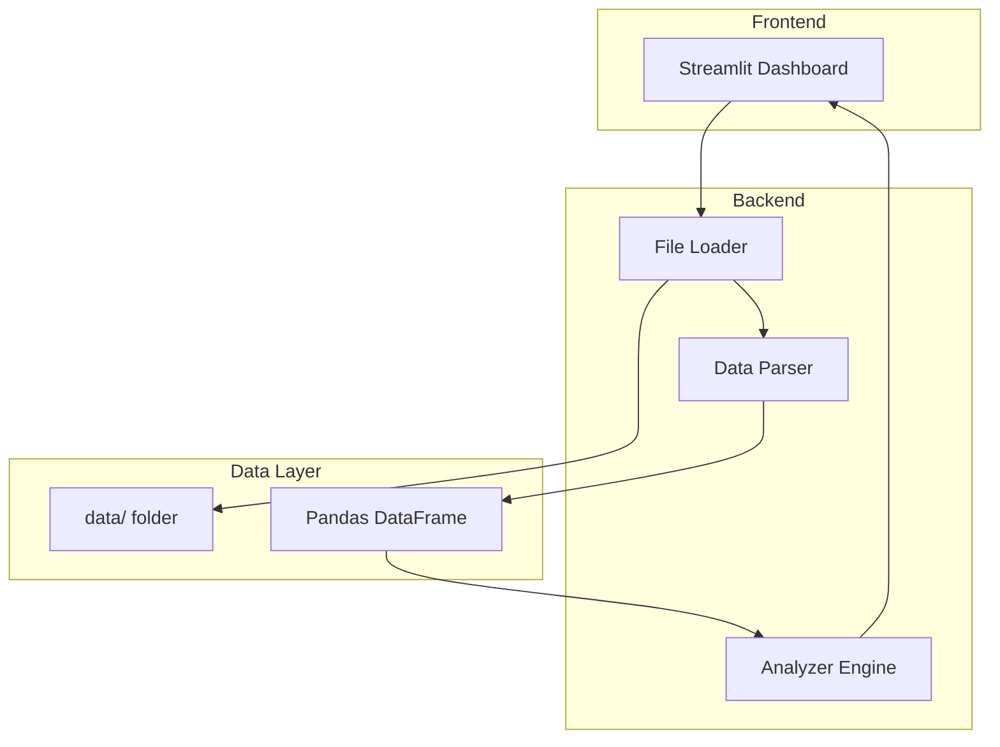

# Design Document

## Overview

Deal Sourcing Analyzerは、PythonベースのWebアプリケーションとして実装する。Streamlitを使用してダッシュボードUIを構築し、Pandasでデータ処理を行う。ユーザーはファイル名を指定してデータを読み込み、Paid/Non-Paid、Price Band、ASIN Tenure別の分析結果をインタラクティブに閲覧できる。

## Architecture



## Components and Interfaces

### 1. FileLoader (file_loader.py)

ファイル読み込みを担当するモジュール。

```python
class FileLoader:
    def __init__(self, data_dir: str = "data"):
        """データディレクトリを指定して初期化"""
        
    def load_file(self, filename: str) -> pd.DataFrame:
        """指定されたファイルを読み込みDataFrameとして返す"""
        
    def list_available_files(self) -> List[str]:
        """dataフォルダ内の利用可能なtxtファイル一覧を返す"""
```

### 2. DataParser (data_parser.py)

データのパースとバリデーションを担当。

```python
class DataParser:
    REQUIRED_COLUMNS = [
        'asin', 'MERCHANT_CUSTOMER_ID', 'pf', 'gl', 'Paid-Flag',
        'DealFlag', 'PointsDealFlag', 'Price&PointsDealFlag',
        'RetailFlag', 'DomesticOOCFlag', 'PriceBand', 'ASINTenure',
        'GMS', 'UNITS'
    ]
    
    def parse(self, raw_data: str) -> pd.DataFrame:
        """生データをパースしてDataFrameに変換"""
        
    def validate(self, df: pd.DataFrame) -> ValidationResult:
        """必須カラムの存在とデータ型を検証"""
```

### 3. Analyzer (analyzer.py)

分析ロジックを担当するメインエンジン。

```python
class Analyzer:
    def __init__(self, df: pd.DataFrame):
        """分析対象のDataFrameで初期化"""
    
    def get_summary(self) -> SummaryResult:
        """全体サマリー（総GMS、総ASIN数、全体Sourced率）を返す"""
    
    def analyze_by_paid_flag(self) -> pd.DataFrame:
        """Paid/Non-Paid別の分析結果を返す"""
    
    def analyze_by_price_band(self) -> pd.DataFrame:
        """Price Band別の分析結果を返す"""
    
    def analyze_by_tenure(self) -> pd.DataFrame:
        """ASIN Tenure別の分析結果を返す"""
    
    def calculate_opportunity_score(self, segment_df: pd.DataFrame) -> pd.DataFrame:
        """各セグメントのOpportunityスコアを算出"""
```

### 4. Dashboard (app.py)

Streamlitベースのダッシュボード。

```python
# Streamlit app structure
def main():
    st.title("Deal Sourcing Analyzer")
    
    # File selection
    filename = st.selectbox("ファイルを選択", available_files)
    
    # Load and analyze
    if st.button("分析開始"):
        df = load_and_parse(filename)
        analyzer = Analyzer(df)
        
        # Display sections
        display_summary(analyzer.get_summary())
        display_paid_analysis(analyzer.analyze_by_paid_flag())
        display_price_band_analysis(analyzer.analyze_by_price_band())
        display_tenure_analysis(analyzer.analyze_by_tenure())
```

## Data Models

### InputData Schema

| Column | Type | Description |
|--------|------|-------------|
| asin | string | ASIN識別子 |
| MERCHANT_CUSTOMER_ID | string | セラーID |
| pf | string | Product Family |
| gl | string | GL Category |
| Paid-Flag | string (Y/N) | Paidセラーフラグ |
| DealFlag | string | Deal状態 |
| PointsDealFlag | string | Points Deal状態 |
| Price&PointsDealFlag | string (Sourced/NonSourced) | 分析の主キー |
| RetailFlag | string | Retailフラグ |
| DomesticOOCFlag | string | Domestic OOCフラグ |
| PriceBand | string | 価格帯区分 |
| ASINTenure | string | ASIN出品期間区分 |
| GMS | float | 売上金額 |
| UNITS | int | 販売数量 |

### AnalysisResult Schema

```python
@dataclass
class SegmentAnalysis:
    segment_name: str
    total_gms: float
    sourced_gms: float
    nonsourced_gms: float
    total_asin_count: int
    sourced_asin_count: int
    nonsourced_asin_count: int
    sourced_rate: float  # 0.0 - 1.0
    gms_per_asin: float
    opportunity_gms: float
    opportunity_ratio: float  # NonSourced GMS / Total GMS
    opportunity_level: str  # "高", "中", "低"
```

### Price Band Sort Order

```python
PRICE_BAND_ORDER = [
    '1~1000', '1001~2000', '2001~3000', '3001~4000', '4001~5000',
    '5001~10000', '10001~50000', '50001~100000', '100000~', 'Unknown'
]
```

### ASIN Tenure Sort Order

```python
TENURE_ORDER = [
    '1.0-30 days', '2.31-90 days', '3.91-180 days', '4.181-365 days',
    '5.1-2 years', '6.2-3 years', '7.3-4 years', '8.4-5 years',
    '9.5-6 years', '10.6-7 years', '11.7-8 years', '12.8-9 years',
    '13.9-10 years', '14.10+ years', '15.Unknown'
]
```


## Correctness Properties

*A property is a characteristic or behavior that should hold true across all valid executions of a system-essentially, a formal statement about what the system should do. Properties serve as the bridge between human-readable specifications and machine-verifiable correctness guarantees.*

### Property 1: File Loading Consistency
*For any* valid txt file in the data folder, loading the file should return a DataFrame containing all 14 required columns with the correct data types.
**Validates: Requirements 1.1, 1.2**

### Property 2: Group Aggregation Accuracy
*For any* DataFrame and grouping column (Paid-Flag, PriceBand, or ASINTenure), the sum of GMS across all groups should equal the total GMS of the original DataFrame.
**Validates: Requirements 2.1, 3.1, 4.1**

### Property 3: Metric Calculation Consistency
*For any* segment analysis result, GMS_per_ASIN should equal total_gms divided by asin_count (when asin_count > 0).
**Validates: Requirements 2.2, 3.2, 4.2**

### Property 4: Sourced Rate Calculation
*For any* segment analysis result, sourced_rate should equal sourced_asin_count divided by total_asin_count, and the value should be between 0.0 and 1.0.
**Validates: Requirements 2.3**

### Property 5: Opportunity Equals NonSourced GMS
*For any* segment analysis result, opportunity_gms should equal nonsourced_gms.
**Validates: Requirements 2.4, 3.4, 4.4**

### Property 6: Price Band Sort Order
*For any* Price Band analysis result, the segments should be sorted according to the predefined PRICE_BAND_ORDER.
**Validates: Requirements 3.3**

### Property 7: ASIN Tenure Sort Order
*For any* ASIN Tenure analysis result, the segments should be sorted according to the predefined TENURE_ORDER.
**Validates: Requirements 4.3**

### Property 8: Opportunity Level Classification
*For any* segment with sourced_rate >= 0.8, the opportunity_level should be "低" (Opportunity少).
**Validates: Requirements 5.1**

### Property 9: High Opportunity Identification
*For any* segment where opportunity_ratio is in the top quartile, the segment should be marked as high opportunity.
**Validates: Requirements 5.2**

## Error Handling

| Error Type | Condition | Response |
|------------|-----------|----------|
| FileNotFoundError | 指定ファイルが存在しない | エラーメッセージ表示、ファイル一覧を再表示 |
| ParseError | カラム不足、データ型不正 | 詳細エラーメッセージ表示、問題箇所を特定 |
| EmptyDataError | ファイルが空 | 警告メッセージ表示 |
| ZeroDivisionError | ASIN数が0の場合 | GMS_per_ASINを0として処理 |

## Testing Strategy

### Unit Tests
- FileLoader: ファイル読み込み、存在しないファイルのエラー処理
- DataParser: 正常データのパース、不正データのバリデーション
- Analyzer: 各集計メソッドの計算結果

### Property-Based Tests (pytest + hypothesis)
- Property 1-9を検証するプロパティベーステスト
- ランダムに生成したDataFrameに対して各プロパティが成り立つことを確認
- 最低100イテレーション実行

### Test Data Generation Strategy
```python
from hypothesis import given, strategies as st
import pandas as pd

# Generate random valid DataFrame
@st.composite
def valid_dataframe(draw):
    n_rows = draw(st.integers(min_value=1, max_value=100))
    return pd.DataFrame({
        'asin': [f'ASIN{i}' for i in range(n_rows)],
        'MERCHANT_CUSTOMER_ID': [f'MID{i}' for i in range(n_rows)],
        'Paid-Flag': draw(st.lists(st.sampled_from(['Y', 'N']), min_size=n_rows, max_size=n_rows)),
        'Price&PointsDealFlag': draw(st.lists(st.sampled_from(['Sourced', 'NonSourced']), min_size=n_rows, max_size=n_rows)),
        'PriceBand': draw(st.lists(st.sampled_from(PRICE_BAND_ORDER), min_size=n_rows, max_size=n_rows)),
        'ASINTenure': draw(st.lists(st.sampled_from(TENURE_ORDER), min_size=n_rows, max_size=n_rows)),
        'GMS': draw(st.lists(st.floats(min_value=0, max_value=1000000), min_size=n_rows, max_size=n_rows)),
        # ... other columns
    })
```
