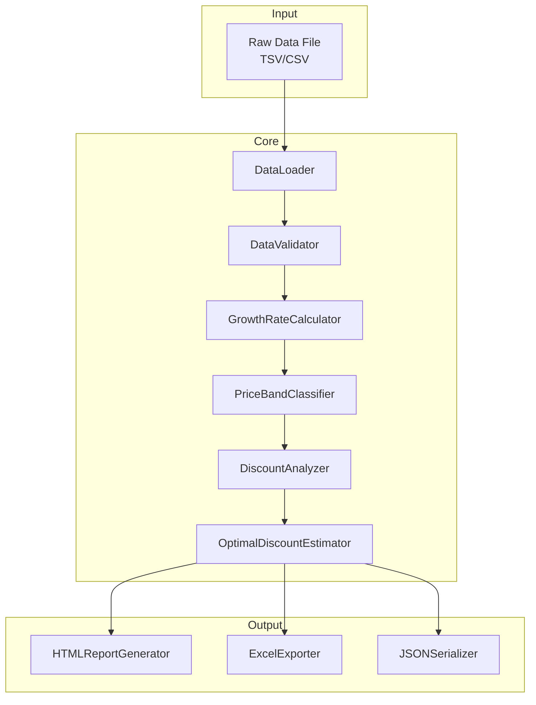

# Design Document: Discount Effectiveness Analyzer

## Overview

本システムは、プロモーションイベントにおける割引効果を統計的に分析し、PF（プラットフォーム）×価格帯ごとに最適な割引率を試算するPythonアプリケーションである。

主要な機能：
1. Rawデータの読み込みとバリデーション
2. 売上伸び率（growth_rate）の計算
3. 価格帯の自動分類
4. PF×価格帯ごとの統計分析（相関分析・回帰分析）
5. 最適割引率の推定
6. HTMLレポートとExcelファイルの出力

## Architecture



## Components and Interfaces

### 1. DataLoader

```python
class DataLoader:
    """Rawデータファイルの読み込みを担当"""
    
    def load(self, file_path: str) -> pd.DataFrame:
        """
        ファイルを読み込みDataFrameを返す
        
        Args:
            file_path: 入力ファイルパス
            
        Returns:
            pd.DataFrame: 読み込んだデータ
            
        Raises:
            FileNotFoundError: ファイルが存在しない場合
            ParseError: パースに失敗した場合
        """
        pass
```

### 2. DataValidator

```python
@dataclass
class ValidationResult:
    is_valid: bool
    missing_columns: List[str]
    invalid_rows: List[int]
    error_messages: List[str]

class DataValidator:
    """データのバリデーションを担当"""
    
    REQUIRED_COLUMNS = [
        'asin', 'pf', 'our_price', 'current_discount_percent',
        'past_month_gms', 'promotion_ops'
    ]
    
    def validate(self, df: pd.DataFrame) -> ValidationResult:
        """必須カラムの存在とデータ型を検証"""
        pass
    
    def clean(self, df: pd.DataFrame) -> pd.DataFrame:
        """無効な行を除外してクリーンなデータを返す"""
        pass
```

### 3. GrowthRateCalculator

```python
class GrowthRateCalculator:
    """売上伸び率の計算を担当"""
    
    OUTLIER_THRESHOLD = 10000  # 10000%以上を外れ値とする
    
    def calculate(self, df: pd.DataFrame) -> pd.DataFrame:
        """
        growth_rate = (promotion_ops / past_month_gms - 1) * 100 を計算
        
        Returns:
            DataFrame with 'growth_rate' and 'is_outlier' columns added
        """
        pass
```

### 4. PriceBandClassifier

```python
class PriceBandClassifier:
    """価格帯の分類を担当"""
    
    PRICE_BANDS = [
        (0, 1000, '1~1000'),
        (1001, 2000, '1001~2000'),
        (2001, 3000, '2001~3000'),
        (3001, 5000, '3001~5000'),
        (5001, 10000, '5001~10000'),
        (10001, 50000, '10001~50000'),
        (50001, float('inf'), '50001以上'),
    ]
    
    def classify(self, df: pd.DataFrame) -> pd.DataFrame:
        """our_priceを基に価格帯を分類"""
        pass
```

### 5. DiscountAnalyzer

```python
@dataclass
class SegmentAnalysisResult:
    pf: str
    price_band: str
    sample_count: int
    correlation: float
    regression_coef: float
    regression_intercept: float
    r_squared: float
    p_value: float
    is_significant: bool
    mean_discount: float
    mean_growth_rate: float

class DiscountAnalyzer:
    """PF×価格帯ごとの統計分析を担当"""
    
    MIN_SAMPLE_SIZE = 10
    SIGNIFICANCE_LEVEL = 0.05
    
    def analyze(self, df: pd.DataFrame) -> List[SegmentAnalysisResult]:
        """
        PF×価格帯ごとに相関分析・回帰分析を実行
        """
        pass
```

### 6. OptimalDiscountEstimator

```python
@dataclass
class OptimalDiscountRecommendation:
    pf: str
    price_band: str
    optimal_discount_rate: float
    expected_growth_rate: float
    confidence_level: str
    note: str

class OptimalDiscountEstimator:
    """最適割引率の推定を担当"""
    
    DISCOUNT_MIN = 0
    DISCOUNT_MAX = 50
    
    def estimate(self, analysis_results: List[SegmentAnalysisResult]) -> List[OptimalDiscountRecommendation]:
        """
        回帰分析結果から最適割引率を推定
        """
        pass
```

### 7. HTMLReportGenerator

```python
class HTMLReportGenerator:
    """HTMLレポートの生成を担当"""
    
    def generate(
        self,
        analysis_results: List[SegmentAnalysisResult],
        recommendations: List[OptimalDiscountRecommendation],
        output_path: str
    ) -> None:
        """
        HTMLレポートを生成
        - サマリーテーブル
        - 散布図（PF×価格帯ごと）
        - 推奨割引率一覧
        """
        pass
```

### 8. ExcelExporter

```python
class ExcelExporter:
    """Excelファイルの出力を担当"""
    
    def export(
        self,
        df: pd.DataFrame,
        analysis_results: List[SegmentAnalysisResult],
        recommendations: List[OptimalDiscountRecommendation],
        output_path: str
    ) -> None:
        """
        Excelファイルを生成
        - サマリーシート
        - 詳細データシート
        - 推奨割引率シート
        """
        pass
```

### 9. JSONSerializer

```python
class JSONSerializer:
    """分析結果のシリアライズを担当"""
    
    def serialize(self, results: AnalysisResults) -> str:
        """分析結果をJSON文字列に変換"""
        pass
    
    def deserialize(self, json_str: str) -> AnalysisResults:
        """JSON文字列から分析結果を復元"""
        pass
```

## Data Models

```python
@dataclass
class AnalysisResults:
    """分析結果の全体を保持するデータクラス"""
    
    raw_data_path: str
    analysis_timestamp: str
    total_records: int
    valid_records: int
    excluded_records: int
    segment_analyses: List[SegmentAnalysisResult]
    recommendations: List[OptimalDiscountRecommendation]
    
    def to_dict(self) -> dict:
        """辞書形式に変換"""
        pass
    
    @classmethod
    def from_dict(cls, data: dict) -> 'AnalysisResults':
        """辞書から復元"""
        pass
```


## Correctness Properties

*A property is a characteristic or behavior that should hold true across all valid executions of a system-essentially, a formal statement about what the system should do. Properties serve as the bridge between human-readable specifications and machine-verifiable correctness guarantees.*

### Property Reflection

冗長性の分析：
- 1.3と1.4は両方ともデータクリーニングに関するが、異なる条件（非数値 vs 0以下）を扱うため別々に保持
- 6.2, 6.3, 6.4はHTML出力の異なる要素を検証するため、1つのプロパティに統合可能
- 7.2, 7.3, 7.4はExcel出力の異なるシートを検証するため、1つのプロパティに統合可能
- 8.2と8.3は同じラウンドトリップ検証のため、8.3に統合

### Properties

**Property 1: Growth Rate Calculation Correctness**
*For any* valid DataFrame with positive past_month_gms and promotion_ops values, the calculated growth_rate SHALL equal `round((promotion_ops / past_month_gms - 1) * 100, 2)`
**Validates: Requirements 2.1, 2.2**

**Property 2: Invalid Data Exclusion**
*For any* DataFrame containing rows with past_month_gms <= 0 or non-numeric values in numeric columns, after cleaning, the resulting DataFrame SHALL NOT contain any such invalid rows
**Validates: Requirements 1.3, 1.4**

**Property 3: Price Band Classification Correctness**
*For any* our_price value, the classified price_band SHALL match the expected band based on the defined ranges (1~1000, 1001~2000, etc.), and values <= 0 or NaN SHALL be classified as "Unknown"
**Validates: Requirements 3.1, 3.2**

**Property 4: Outlier Flagging**
*For any* calculated growth_rate >= 10000, the is_outlier flag SHALL be True; for growth_rate < 10000, the flag SHALL be False
**Validates: Requirements 2.3**

**Property 5: Correlation Coefficient Range**
*For any* segment analysis result, the correlation coefficient SHALL be in the range [-1, 1]
**Validates: Requirements 4.2**

**Property 6: Sample Size Threshold**
*For any* segment with sample_count < 10, the analysis result SHALL be marked as insufficient sample; segments with sample_count >= 10 SHALL NOT be marked as insufficient
**Validates: Requirements 4.4**

**Property 7: Optimal Discount Rate Range**
*For any* optimal discount recommendation, the optimal_discount_rate SHALL be in the range [0, 50]
**Validates: Requirements 5.2**

**Property 8: Statistical Significance Reporting**
*For any* segment analysis with p_value > 0.05, is_significant SHALL be False and the recommendation note SHALL indicate no significant relationship
**Validates: Requirements 5.3**

**Property 9: Missing Column Detection**
*For any* DataFrame missing one or more required columns, the validation result SHALL contain exactly those missing column names
**Validates: Requirements 1.2**

**Property 10: HTML Report Content Completeness**
*For any* generated HTML report, the content SHALL contain a summary table element, scatter plot elements for each PF×price_band combination, and a recommendations table
**Validates: Requirements 6.2, 6.3, 6.4**

**Property 11: Excel Sheet Completeness**
*For any* generated Excel file, the workbook SHALL contain sheets named "サマリー", "詳細データ", and "推奨割引率"
**Validates: Requirements 7.2, 7.3, 7.4**

**Property 12: Serialization Round Trip**
*For any* valid AnalysisResults object, serializing to JSON and then deserializing SHALL produce an object with identical attribute values
**Validates: Requirements 8.1, 8.2, 8.3**

## Error Handling

### エラー種別と対応

| エラー種別 | 発生条件 | 対応 |
|-----------|---------|------|
| FileNotFoundError | 指定ファイルが存在しない | エラーメッセージを表示して終了 |
| ParseError | ファイルのパースに失敗 | エラーメッセージを表示して終了 |
| ValidationError | 必須カラムが不足 | 不足カラム名を表示して終了 |
| InsufficientDataError | 有効データが0件 | 警告を表示して終了 |
| StatisticalError | 統計計算に失敗 | 該当セグメントをスキップしてログ記録 |

### ログ出力

- INFO: 処理の進捗状況
- WARNING: 除外された行数、サンプル不足のセグメント
- ERROR: 致命的なエラー

## Testing Strategy

### Property-Based Testing

本プロジェクトでは**Hypothesis**ライブラリを使用してプロパティベーステストを実施する。

```python
# pytest + hypothesis を使用
pip install pytest hypothesis
```

各プロパティベーステストは最低100回のイテレーションを実行する。

テストファイル構成：
- `tests/test_growth_rate_properties.py` - Property 1, 4
- `tests/test_data_validation_properties.py` - Property 2, 9
- `tests/test_price_band_properties.py` - Property 3
- `tests/test_analysis_properties.py` - Property 5, 6, 7, 8
- `tests/test_output_properties.py` - Property 10, 11
- `tests/test_serialization_properties.py` - Property 12

各テストには以下の形式でコメントを付与：
```python
# **Feature: discount-effectiveness-analyzer, Property 1: Growth Rate Calculation Correctness**
# **Validates: Requirements 2.1, 2.2**
```

### Unit Tests

ユニットテストは以下のケースをカバー：
- 境界値テスト（価格帯の境界、割引率0%/50%）
- エラーケース（空ファイル、不正なフォーマット）
- 統合テスト（エンドツーエンドの処理フロー）

### Test Data Generation

Hypothesisのストラテジーを使用してテストデータを生成：

```python
from hypothesis import strategies as st

# 有効なDataFrame行を生成
valid_row = st.fixed_dictionaries({
    'asin': st.text(min_size=10, max_size=10),
    'pf': st.sampled_from(['Books', 'Electronics', 'Fashion', 'Home']),
    'our_price': st.floats(min_value=1, max_value=100000),
    'current_discount_percent': st.floats(min_value=0, max_value=50),
    'past_month_gms': st.floats(min_value=0.01, max_value=1000000),
    'promotion_ops': st.floats(min_value=0, max_value=10000000),
})
```
