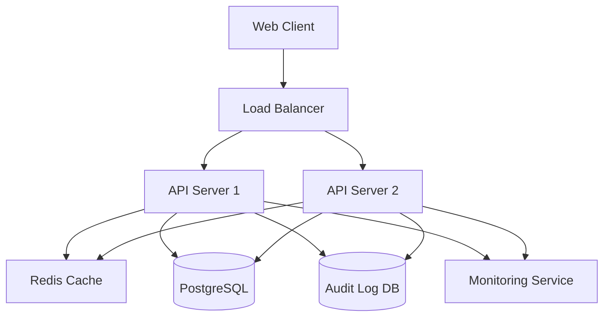

# Reservation Management System Design

## Overview

The Reservation Management System is a web-based application built with a modern three-tier architecture: presentation layer (React frontend), application layer (Node.js/Express API), and data layer (PostgreSQL with Redis caching). The system emphasizes data consistency, security, and high availability to meet the 99.9% SLA requirement.

## Architecture

### System Architecture


### Technology Stack
- **Frontend**: React with TypeScript for type safety
- **Backend**: Node.js with Express framework
- **Database**: PostgreSQL for ACID compliance and data integrity
- **Cache**: Redis for session management and performance optimization
- **Authentication**: JWT tokens with refresh token rotation
- **Monitoring**: Application metrics and health checks
- **Deployment**: Docker containers with orchestration for high availability

## Components and Interfaces

### Core Components

1. **Authentication Service**
   - User registration and login
   - JWT token generation and validation
   - Session management with Redis
   - Password hashing with bcrypt

2. **Reservation Service**
   - Availability checking with database locks
   - Reservation CRUD operations
   - Conflict detection and prevention
   - Notification service integration

3. **User Management Service**
   - User profile management
   - Role-based access control
   - Account verification and recovery

4. **Admin Dashboard Service**
   - Real-time metrics aggregation
   - System health monitoring
   - User and reservation analytics
   - Report generation

5. **Audit Logging Service**
   - Immutable event logging
   - Structured log format (JSON)
   - Log retention and archival
   - Security event detection

### API Interfaces

```typescript
// Authentication endpoints
POST /api/auth/register
POST /api/auth/login
POST /api/auth/refresh
POST /api/auth/logout

// Reservation endpoints
GET /api/reservations
POST /api/reservations
PUT /api/reservations/:id
DELETE /api/reservations/:id
GET /api/reservations/availability

// Admin endpoints
GET /api/admin/dashboard
GET /api/admin/users
GET /api/admin/reservations
GET /api/admin/audit-logs
GET /api/admin/metrics
```

## Data Models

### User Model
```typescript
interface User {
  id: string;
  email: string;
  passwordHash: string;
  firstName: string;
  lastName: string;
  role: 'user' | 'admin';
  isVerified: boolean;
  createdAt: Date;
  updatedAt: Date;
}
```

### Reservation Model
```typescript
interface Reservation {
  id: string;
  userId: string;
  resourceId: string;
  startTime: Date;
  endTime: Date;
  status: 'confirmed' | 'cancelled' | 'pending';
  notes?: string;
  createdAt: Date;
  updatedAt: Date;
}
```

### Resource Model
```typescript
interface Resource {
  id: string;
  name: string;
  description: string;
  capacity: number;
  isActive: boolean;
  createdAt: Date;
  updatedAt: Date;
}
```

### Audit Log Model
```typescript
interface AuditLog {
  id: string;
  userId?: string;
  action: string;
  resourceType: string;
  resourceId: string;
  details: Record<string, any>;
  ipAddress: string;
  userAgent: string;
  timestamp: Date;
}
```
## Correctness Properties

*A property is a characteristic or behavior that should hold true across all valid executions of a system-essentially, a formal statement about what the system should do. Properties serve as the bridge between human-readable specifications and machine-verifiable correctness guarantees.*

**Property 1: User registration creates valid accounts**
*For any* valid user registration data, the system should create a new user account, authenticate the user automatically, and prevent duplicate registrations with existing emails
**Validates: Requirements 1.1, 1.2, 1.3, 1.5**

**Property 2: Reservation availability is accurate**
*For any* time slot query, the system should return only genuinely available slots that do not conflict with existing confirmed reservations
**Validates: Requirements 2.1, 2.3**

**Property 3: Valid reservations are created successfully**
*For any* valid reservation request for an available time slot, the system should create the reservation and confirm the booking
**Validates: Requirements 2.2**

**Property 4: Reservation conflicts are prevented**
*For any* reservation request that conflicts with existing bookings, the system should reject the request and suggest alternative times
**Validates: Requirements 2.3**

**Property 5: Reservation modifications preserve availability rules**
*For any* reservation modification request, the system should only allow changes to genuinely available time slots and update availability accordingly
**Validates: Requirements 3.1, 3.2**

**Property 6: Comprehensive audit logging**
*For any* system operation (registration, reservation creation/modification/cancellation, authentication events), the system should create corresponding audit log entries with complete details including timestamp and user information
**Validates: Requirements 1.4, 2.4, 3.3, 5.5, 6.1**

**Property 7: Notification consistency**
*For any* reservation confirmation or modification, the system should send appropriate notifications to the affected user
**Validates: Requirements 2.5, 3.4**

**Property 8: Authentication security enforcement**
*For any* system access attempt, the authentication service should verify credentials, log all authentication activities, and manage sessions according to security policies
**Validates: Requirements 5.1, 5.2, 5.3, 5.4**

**Property 9: Admin dashboard data accuracy**
*For any* admin dashboard request, the system should display real-time metrics and reservation statistics that accurately reflect the current system state
**Validates: Requirements 4.1, 4.2, 4.5**

**Property 10: Audit log integrity and security**
*For any* audit log access or retrieval, the system should provide secure, tamper-evident logs and maintain retention according to compliance requirements
**Validates: Requirements 6.2, 6.3, 6.5**

**Property 11: Security monitoring and alerting**
*For any* suspicious activity or security event, the system should flag the event and alert administrators appropriately
**Validates: Requirements 6.4**

**Property 12: System availability and recovery**
*For any* system failure or performance degradation, the system should implement automatic recovery mechanisms where possible and maintain accurate uptime metrics
**Validates: Requirements 7.1, 7.2, 7.4, 7.5**

## Error Handling

### Database Errors
- Connection failures: Implement retry logic with exponential backoff
- Transaction conflicts: Use optimistic locking for reservation conflicts
- Data integrity violations: Return structured error responses with specific field validation

### Authentication Errors
- Invalid credentials: Rate limiting and account lockout after multiple failures
- Expired tokens: Automatic refresh token rotation
- Session management: Graceful session timeout with user notification

### Reservation Conflicts
- Double booking prevention: Database-level constraints and application-level validation
- Concurrent modification: Optimistic locking with conflict resolution
- Invalid time ranges: Input validation with clear error messages

### System Availability
- Load balancer health checks: Automatic failover to healthy instances
- Database failover: Read replicas for high availability
- Graceful degradation: Core functionality maintained during partial outages

## Testing Strategy

### Unit Testing Framework
- **Framework**: Jest for Node.js backend testing
- **Coverage**: Minimum 80% code coverage for core business logic
- **Focus Areas**: Individual service methods, validation functions, utility functions

### Property-Based Testing Framework
- **Framework**: fast-check for JavaScript/TypeScript property-based testing
- **Configuration**: Minimum 100 iterations per property test
- **Integration**: Each property test must reference its corresponding design document property using the format: `**Feature: reservation-management, Property {number}: {property_text}**`

### Testing Approach
- **Unit Tests**: Verify specific examples, edge cases, and error conditions for individual components
- **Property Tests**: Verify universal properties hold across all valid inputs using generated test data
- **Integration Tests**: Test component interactions and end-to-end workflows
- **Performance Tests**: Validate SLA compliance and system performance under load

### Test Data Generation
- **Smart Generators**: Create realistic test data that respects business constraints
- **Edge Case Coverage**: Include boundary conditions, empty inputs, and invalid data
- **Concurrent Testing**: Simulate multiple users and concurrent operations

### Continuous Testing
- **Automated Pipeline**: All tests run on every code change
- **Performance Monitoring**: Continuous SLA compliance verification
- **Security Testing**: Regular security scans and penetration testing