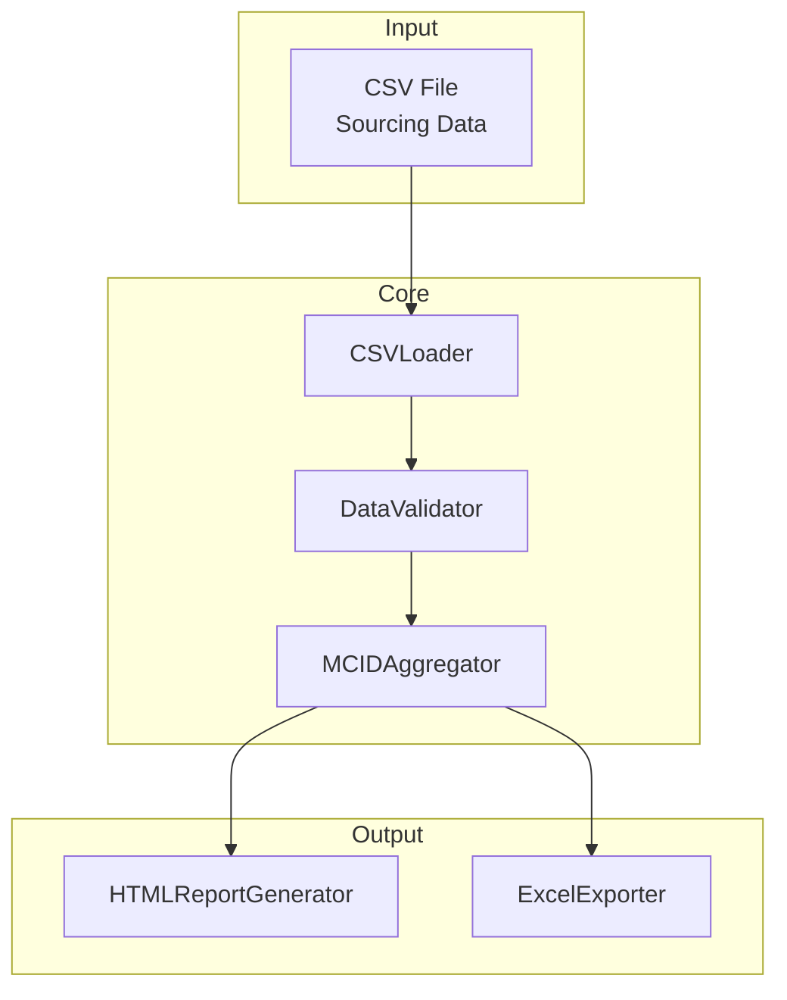

# Design Document: Sourcing Data Aggregator

## Overview

本システムは、毎日更新されるソーシングデータCSVファイルを読み込み、MCID単位で集約してピボットテーブル形式のレポートを生成するPythonアプリケーションである。Python初心者でも簡単に使えるよう、バッチファイルによる実行とシンプルなインターフェースを提供する。

主要な機能：
1. CSVファイルの読み込みとバリデーション
2. MCID単位でのデータ集約（合計GMS、Sourced GMS、Sourced GMS %の計算）
3. HTMLレポートとExcelファイルの出力
4. 初心者向けの簡単なバッチファイル実行

## Architecture



## Components and Interfaces

### 1. CSVLoader

```python
class CSVLoader:
    """CSVファイルの読み込みを担当"""
    
    def load(self, file_path: str) -> pd.DataFrame:
        """
        CSVファイルを読み込みDataFrameを返す
        
        Args:
            file_path: 入力CSVファイルパス
            
        Returns:
            pd.DataFrame: 読み込んだデータ
            
        Raises:
            FileNotFoundError: ファイルが存在しない場合
            UnicodeDecodeError: エンコーディングエラーの場合
        """
        # UTF-8で読み込み、失敗したらcp932を試行
        pass
```

### 2. DataValidator

```python
@dataclass
class ValidationResult:
    is_valid: bool
    missing_columns: List[str]
    error_messages: List[str]
    total_rows: int

class DataValidator:
    """データのバリデーションを担当"""
    
    REQUIRED_COLUMNS = [
        'mcid',
        'total_t30d_gms_BAU',
        'SSHVE2_SourcedFlag'
    ]
    
    def validate(self, df: pd.DataFrame) -> ValidationResult:
        """
        必須カラムの存在とデータの妥当性を検証
        
        Args:
            df: 検証対象のDataFrame
            
        Returns:
            ValidationResult: 検証結果
        """
        pass
    
    def clean(self, df: pd.DataFrame) -> pd.DataFrame:
        """
        データをクリーニング
        - total_t30d_gms_BAUを数値型に変換（変換失敗は0）
        - SSHVE2_SourcedFlagを文字列型に変換
        - mcidの欠損値を除外
        
        Returns:
            pd.DataFrame: クリーニング済みデータ
        """
        pass
```

### 3. MCIDAggregator

```python
@dataclass
class AggregatedResult:
    mcid: str
    total_gms: float
    sourced_gms: float
    sourced_gms_percent: float

class MCIDAggregator:
    """MCID単位でのデータ集約を担当"""
    
    def aggregate(self, df: pd.DataFrame) -> List[AggregatedResult]:
        """
        MCID単位でデータを集約
        
        処理内容:
        1. mcidでグループ化
        2. 各グループで以下を計算:
           - total_gms = sum(total_t30d_gms_BAU)
           - sourced_gms = sum(total_t30d_gms_BAU where SSHVE2_SourcedFlag == 'Y')
           - sourced_gms_percent = (sourced_gms / total_gms) * 100
        
        Args:
            df: クリーニング済みDataFrame
            
        Returns:
            List[AggregatedResult]: 集約結果のリスト
        """
        pass
    
    def _calculate_sourced_gms(self, group: pd.DataFrame) -> float:
        """
        Sourced GMSを計算
        SSHVE2_SourcedFlag == 'Y' の行のtotal_t30d_gms_BAUを合計
        """
        pass
    
    def _calculate_percentage(self, sourced_gms: float, total_gms: float) -> float:
        """
        Sourced GMS %を計算
        total_gmsが0の場合は0を返す
        """
        pass
```

### 4. HTMLReportGenerator

```python
class HTMLReportGenerator:
    """HTMLレポートの生成を担当"""
    
    def generate(
        self,
        results: List[AggregatedResult],
        output_path: str,
        source_file: str
    ) -> None:
        """
        HTMLレポートを生成
        
        レポート内容:
        - タイトル: "Sourcing Data Aggregation Report"
        - 生成日時
        - ソースファイル名
        - 集約結果テーブル（MCID, Total GMS, Sourced GMS, Sourced GMS %）
        - 数値フォーマット: カンマ区切り、小数点2桁
        
        Args:
            results: 集約結果
            output_path: 出力HTMLファイルパス
            source_file: ソースCSVファイルパス
        """
        pass
    
    def _format_number(self, value: float) -> str:
        """数値をカンマ区切りでフォーマット"""
        pass
    
    def _format_percentage(self, value: float) -> str:
        """パーセンテージを小数点2桁でフォーマット"""
        pass
```

### 5. ExcelExporter

```python
class ExcelExporter:
    """Excelファイルの出力を担当"""
    
    def export(
        self,
        results: List[AggregatedResult],
        output_path: str
    ) -> None:
        """
        Excelファイルを生成
        
        シート構成:
        - "集約結果": MCID, Total GMS, Sourced GMS, Sourced GMS %
        
        フォーマット:
        - 数値列: カンマ区切り、小数点2桁
        - パーセンテージ列: パーセンテージ形式、小数点2桁
        - ヘッダー: 太字、背景色
        
        Args:
            results: 集約結果
            output_path: 出力Excelファイルパス
        """
        pass
```

## Data Models

```python
@dataclass
class AggregatedResult:
    """集約結果を保持するデータクラス"""
    
    mcid: str
    total_gms: float
    sourced_gms: float
    sourced_gms_percent: float
    
    def to_dict(self) -> dict:
        """辞書形式に変換"""
        return {
            'MCID': self.mcid,
            'Total GMS': self.total_gms,
            'Sourced GMS': self.sourced_gms,
            'Sourced GMS %': self.sourced_gms_percent
        }

@dataclass
class ValidationResult:
    """バリデーション結果を保持するデータクラス"""
    
    is_valid: bool
    missing_columns: List[str]
    error_messages: List[str]
    total_rows: int
```

## Correctness Properties

*A property is a characteristic or behavior that should hold true across all valid executions of a system-essentially, a formal statement about what the system should do. Properties serve as the bridge between human-readable specifications and machine-verifiable correctness guarantees.*

Before writing the correctness properties, I need to analyze the acceptance criteria for testability:


### Property Reflection

冗長性の分析：
- 5.1, 5.2, 5.3, 5.4は全て欠損カラム検出に関するため、1つのプロパティに統合可能
- 3.2と3.3はHTMLテーブル構造に関するため、1つのプロパティに統合可能
- 3.4と3.5は数値フォーマットに関するため、1つのプロパティに統合可能
- 2.2, 2.3, 2.4は全て集約計算の一部であり、1つのプロパティで検証可能
- 6.2, 6.3, 6.4は全てExcelフォーマットに関するため、1つのプロパティに統合可能

### Properties

**Property 1: CSV Loading with UTF-8**
*For any* valid CSV content written with UTF-8 encoding, loading the file SHALL return a DataFrame with identical content
**Validates: Requirements 1.1**

**Property 2: Complete Row Loading**
*For any* DataFrame containing the required columns (mcid, total_t30d_gms_BAU, SSHVE2_SourcedFlag), all rows SHALL be loaded successfully
**Validates: Requirements 1.2**

**Property 3: Missing Column Detection**
*For any* DataFrame missing one or more required columns (mcid, total_t30d_gms_BAU, SSHVE2_SourcedFlag), the validation result SHALL be invalid and SHALL contain exactly those missing column names in the error message
**Validates: Requirements 1.3, 5.1, 5.2, 5.3, 5.4**

**Property 4: MCID Grouping Completeness**
*For any* valid DataFrame, the aggregation result SHALL contain exactly one entry for each unique mcid value in the input
**Validates: Requirements 2.1**

**Property 5: Aggregation Calculation Correctness**
*For any* MCID group, the total_gms SHALL equal the sum of all total_t30d_gms_BAU values, the sourced_gms SHALL equal the sum of total_t30d_gms_BAU where SSHVE2_SourcedFlag equals "Y", and sourced_gms_percent SHALL equal (sourced_gms / total_gms) * 100 when total_gms > 0, or 0 when total_gms = 0
**Validates: Requirements 2.2, 2.3, 2.4, 2.6**

**Property 6: HTML Table Structure**
*For any* generated HTML report, the table SHALL contain columns in order: MCID, Total GMS, Sourced GMS, Sourced GMS %
**Validates: Requirements 3.1, 3.2, 3.3**

**Property 7: Number Formatting in HTML**
*For any* numeric value >= 1000 in the HTML report, the formatted string SHALL contain comma separators, and any percentage value SHALL be formatted with exactly 2 decimal places
**Validates: Requirements 3.4, 3.5**

**Property 8: HTML Timestamp Presence**
*For any* generated HTML report, the content SHALL contain a timestamp element showing when the report was generated
**Validates: Requirements 3.6**

**Property 9: Timestamped Filename Generation**
*For any* generated output file, the filename SHALL contain a timestamp in the format YYYYMMDD_HHMMSS
**Validates: Requirements 3.7**

**Property 10: Progress Logging**
*For any* execution of the aggregation process, log messages SHALL be generated for each major step (loading, validation, aggregation, report generation)
**Validates: Requirements 4.3**

**Property 11: Output Location Display**
*For any* successful execution, the final log message SHALL contain the full path to the generated output files
**Validates: Requirements 4.4**

**Property 12: Japanese Error Messages**
*For any* error condition, the error message SHALL contain Japanese characters
**Validates: Requirements 4.5**

**Property 13: Excel File Generation with Formatting**
*For any* aggregation result, the generated Excel file SHALL contain a sheet with the same columns as the HTML report, numeric columns SHALL have number formatting applied, and the percentage column SHALL have percentage formatting applied
**Validates: Requirements 6.1, 6.2, 6.3, 6.4**

**Property 14: Consistent Output Filenames**
*For any* execution generating both HTML and Excel files, both filenames SHALL contain the same timestamp
**Validates: Requirements 6.5**

**Property 15: Default Output Location**
*For any* execution without a specified output directory, the output files SHALL be created in the same directory as the input file
**Validates: Requirements 7.5**

**Property 16: Custom Output Location**
*For any* execution with a specified output directory, the output files SHALL be created in that directory
**Validates: Requirements 7.6**

## Error Handling

### エラー種別と対応

| エラー種別 | 発生条件 | 対応 |
|-----------|---------|------|
| FileNotFoundError | 指定ファイルが存在しない | 日本語エラーメッセージを表示して終了 |
| UnicodeDecodeError | エンコーディングエラー | UTF-8で失敗した場合はcp932を試行 |
| ValidationError | 必須カラムが不足 | 不足カラム名を日本語で表示して終了 |
| EmptyDataError | 有効データが0件 | 日本語警告を表示して終了 |
| PermissionError | ファイル書き込み権限なし | 日本語エラーメッセージを表示して終了 |

### ログ出力

- INFO: 処理の進捗状況（読み込み、検証、集約、レポート生成）
- WARNING: データクリーニングで除外された行数
- ERROR: 致命的なエラー（ファイル読み込み失敗、バリデーションエラー）

すべてのログメッセージは日本語で出力する。

## Testing Strategy

### Property-Based Testing

本プロジェクトでは**Hypothesis**ライブラリを使用してプロパティベーステストを実施する。

```python
# pytest + hypothesis を使用
pip install pytest hypothesis
```

各プロパティベーステストは最低100回のイテレーションを実行する。

テストファイル構成：
- `tests/test_csv_loading_properties.py` - Property 1, 2, 3
- `tests/test_aggregation_properties.py` - Property 4, 5
- `tests/test_html_report_properties.py` - Property 6, 7, 8, 9
- `tests/test_logging_properties.py` - Property 10, 11, 12
- `tests/test_excel_export_properties.py` - Property 13, 14
- `tests/test_output_location_properties.py` - Property 15, 16

各テストには以下の形式でコメントを付与：
```python
# **Feature: sourcing-data-aggregator, Property 1: CSV Loading with UTF-8**
# **Validates: Requirements 1.1**
```

### Unit Tests

ユニットテストは以下のケースをカバー：
- 境界値テスト（total_gms = 0のケース、空のDataFrame）
- エラーケース（ファイルが存在しない、カラムが不足）
- エンコーディングフォールバック（UTF-8失敗時のcp932読み込み）
- 統合テスト（エンドツーエンドの処理フロー）

### Test Data Generation

Hypothesisのストラテジーを使用してテストデータを生成：

```python
from hypothesis import strategies as st

# 有効なDataFrame行を生成
valid_row = st.fixed_dictionaries({
    'mcid': st.text(min_size=1, max_size=20),
    'total_t30d_gms_BAU': st.floats(min_value=0, max_value=1000000, allow_nan=False),
    'SSHVE2_SourcedFlag': st.sampled_from(['Y', 'N', '']),
})

# 無効な数値を含む行を生成
invalid_numeric_row = st.fixed_dictionaries({
    'mcid': st.text(min_size=1, max_size=20),
    'total_t30d_gms_BAU': st.one_of(st.text(), st.just('N/A'), st.just('')),
    'SSHVE2_SourcedFlag': st.sampled_from(['Y', 'N']),
})
```

### Testing Balance

- **Property tests**: 入力の広範なカバレッジ（ランダムなMCID、GMS値、フラグの組み合わせ）
- **Unit tests**: 特定のエッジケース（空データ、ゼロ除算、エンコーディングエラー）と統合フロー

プロパティテストは多様な入力を自動生成してシステムの堅牢性を検証し、ユニットテストは具体的なシナリオと統合ポイントを検証する。
