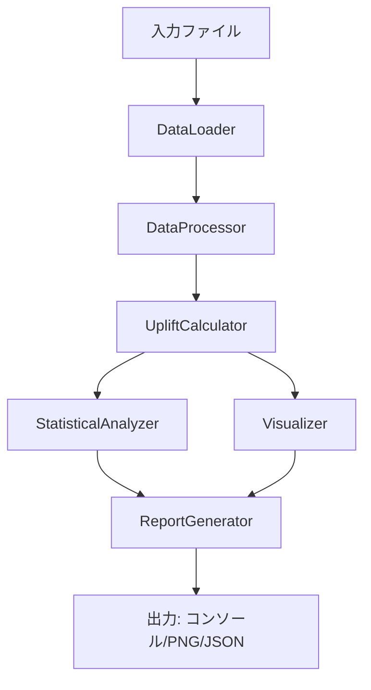

# Design Document

## Overview

本システムは、プロモーションデータを分析し、価格（our_price）と割引率（current_discount_percent）がUpliftに与える影響を視覚的・統計的に明らかにするPythonツールである。特に、重回帰分析を用いて交互作用効果を検証し、「価格と割引率が組み合わさるとUpliftへの影響がさらに大きくなる」という仮説を統計的に検証する。

## Architecture



### コンポーネント構成

1. **DataLoader**: ファイル読み込みとバリデーション
2. **DataProcessor**: データクレンジングと前処理
3. **UpliftCalculator**: Uplift計算
4. **StatisticalAnalyzer**: 重回帰分析と統計検定
5. **Visualizer**: グラフ生成
6. **ReportGenerator**: 結果出力

## Components and Interfaces

### 1. DataLoader

```python
class DataLoader:
    def load_file(self, file_path: str) -> pd.DataFrame:
        """タブ区切りファイルを読み込む"""
        pass
    
    def validate_columns(self, df: pd.DataFrame, required_columns: List[str]) -> bool:
        """必要なカラムの存在を検証"""
        pass
```

### 2. DataProcessor

```python
class DataProcessor:
    def parse_discount_percent(self, value: str) -> float:
        """割引率文字列を数値に変換（例: "5.20%~25%" -> 5.20）"""
        pass
    
    def clean_data(self, df: pd.DataFrame) -> pd.DataFrame:
        """欠損値・異常値の処理"""
        pass
```

### 3. UpliftCalculator

```python
class UpliftCalculator:
    def calculate_uplift(self, promotion_ops: float, past_month_gms: float) -> float:
        """Uplift = (promotion_ops / past_month_gms - 1) * 100"""
        pass
    
    def add_uplift_column(self, df: pd.DataFrame) -> pd.DataFrame:
        """DataFrameにUpliftカラムを追加"""
        pass
```

### 4. StatisticalAnalyzer

```python
class StatisticalAnalyzer:
    def run_regression(self, df: pd.DataFrame) -> RegressionResult:
        """重回帰分析を実行（交互作用項を含む）"""
        pass
    
    def interpret_results(self, result: RegressionResult) -> AnalysisInterpretation:
        """結果を解釈し、仮説検証の結論を導出"""
        pass
```

### 5. Visualizer

```python
class Visualizer:
    def create_scatter_plot(self, df: pd.DataFrame, x_col: str, y_col: str) -> Figure:
        """散布図を生成"""
        pass
    
    def create_heatmap(self, df: pd.DataFrame, x_col: str, y_col: str, value_col: str) -> Figure:
        """ヒートマップを生成"""
        pass
    
    def save_figures(self, figures: List[Figure], output_dir: str) -> List[str]:
        """グラフをPNGとして保存"""
        pass
```

### 6. ReportGenerator

```python
class ReportGenerator:
    def print_summary(self, analysis_result: AnalysisResult) -> None:
        """コンソールにサマリーを表示"""
        pass
    
    def export_json(self, analysis_result: AnalysisResult, output_path: str) -> None:
        """JSON形式で出力"""
        pass
```

## Data Models

```python
from dataclasses import dataclass
from typing import Optional, List

@dataclass
class RegressionCoefficient:
    name: str           # 変数名（our_price, discount_percent, interaction）
    coefficient: float  # 係数
    std_error: float    # 標準誤差
    t_value: float      # t値
    p_value: float      # p値
    is_significant: bool  # p < 0.05

@dataclass
class RegressionResult:
    coefficients: List[RegressionCoefficient]
    r_squared: float           # R²
    adj_r_squared: float       # 調整済みR²
    f_statistic: float         # F統計量
    f_p_value: float           # F検定のp値
    n_observations: int        # 観測数

@dataclass
class AnalysisInterpretation:
    price_effect: str          # 価格の効果の解釈
    discount_effect: str       # 割引率の効果の解釈
    interaction_effect: str    # 交互作用効果の解釈
    hypothesis_supported: bool # 仮説が支持されたか
    conclusion: str            # 総合的な結論

@dataclass
class AnalysisResult:
    regression: RegressionResult
    interpretation: AnalysisInterpretation
    descriptive_stats: dict
    figure_paths: List[str]
```


## Correctness Properties

*A property is a characteristic or behavior that should hold true across all valid executions of a system-essentially, a formal statement about what the system should do. Properties serve as the bridge between human-readable specifications and machine-verifiable correctness guarantees.*

### Property 1: カラム検証の正確性
*For any* DataFrameと必要カラムのリストに対して、必要カラムがすべて存在する場合のみTrueを返し、1つでも欠けている場合はFalseを返す
**Validates: Requirements 1.2**

### Property 2: 割引率パースの正確性
*For any* 有効な割引率文字列（数値、パーセント記号付き、範囲形式）に対して、パース結果は非負の数値であり、元の文字列の先頭数値と一致する
**Validates: Requirements 1.3**

### Property 3: Uplift計算の正確性
*For any* 正のpromotion_opsとpast_month_gmsに対して、Uplift = (promotion_ops / past_month_gms - 1) × 100 が成り立つ
**Validates: Requirements 2.1**

### Property 4: ゼロ・NULL除外の正確性
*For any* past_month_gmsが0またはNULLを含むDataFrameに対して、Uplift計算後のDataFrameにはそれらのレコードが含まれない
**Validates: Requirements 2.2**

### Property 5: Upliftカラム追加の不変性
*For any* DataFrameに対して、Uplift計算後のDataFrameは元のカラムをすべて保持し、かつ'uplift'カラムが追加されている
**Validates: Requirements 2.3**

### Property 6: ビニング処理の正確性
*For any* 数値データに対して、ビニング後の各レコードは指定されたビン境界内に正しく分類される
**Validates: Requirements 3.4**

### Property 7: 有意性判定の正確性
*For any* p値に対して、p < 0.05の場合のみis_significant=Trueとなる
**Validates: Requirements 4.2**

### Property 8: R²値の範囲
*For any* 回帰分析結果に対して、R²値は0以上1以下である
**Validates: Requirements 4.3**

### Property 9: 交互作用効果の結論ロジック
*For any* 交互作用項の係数とp値に対して、係数が正かつp値が0.05未満の場合のみ「統計的に有意」と結論付ける
**Validates: Requirements 4.4**

### Property 10: JSON出力のラウンドトリップ
*For any* AnalysisResult オブジェクトに対して、JSON出力後に再読み込みすると同等のデータが復元される
**Validates: Requirements 5.3**

## Error Handling

| エラー種別 | 発生条件 | 対処 |
|-----------|---------|------|
| FileNotFoundError | 指定ファイルが存在しない | エラーメッセージを表示し終了 |
| MissingColumnError | 必要カラムが存在しない | 不足カラム名を表示し終了 |
| InvalidDataError | 数値変換できないデータ | 該当行をスキップしログ出力 |
| ZeroDivisionError | past_month_gms=0 | 該当行を除外 |
| InsufficientDataError | 回帰分析に必要なデータ数不足 | 警告を表示し分析をスキップ |

## Testing Strategy

### 使用ライブラリ
- **Property-Based Testing**: `hypothesis` ライブラリを使用
- **Unit Testing**: `pytest` を使用

### テスト方針

1. **Unit Tests**: 
   - 特定の入力に対する期待出力の検証
   - エッジケース（空データ、極端な値）の検証
   - 統合テスト（エンドツーエンドの動作確認）

2. **Property-Based Tests**:
   - 各Correctness Propertyに対応するプロパティテストを実装
   - 最低100イテレーションで実行
   - テストには `**Feature: uplift-interaction-analyzer, Property {number}: {property_text}**` の形式でタグ付け

### テストカバレッジ目標
- コアロジック（計算、検証）: 90%以上
- I/O処理: 基本的なハッピーパスとエラーケース
